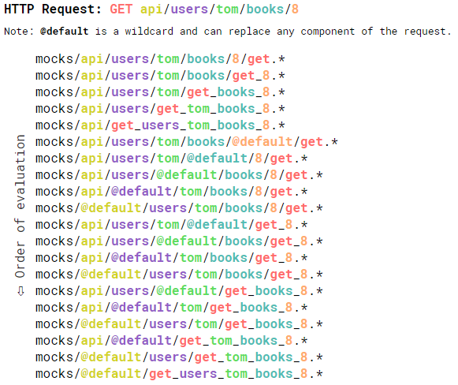

<p align="center">
  
</p>

<p align="center">
  Simple, Fast and Powerful file-based Node.js mock server
</p>

---

# What is Mockiji?
Mockiji is a generic Node.js REST API server.  
Provided a JSON/HTML file, named along rules, it will create a REST route which will serve the file as the response.  
Plus, you can also provide a JavaScript file to generate a response according to the request context.

## Basic examples

**Request:** `GET /api/of/mine`  
**Response:**  `HTTP 200 OK`  
```json
{
	"title": "The response to GET /api/of/mine (HTTP 200 OK)",
	"description": "This filepath is /api/of/mine/get.json"
}
```

**Request:** `POST /api/books/`  
**Response:**  `HTTP 503 Service Unavailable`  
```json
{
	"title": "This is a 503 HTTP Error to the request POST /api/books/",
	"description": "This filepath is /api/books/post.503.json"
}
```

## How does it work? (How can I use it?)
When Mockiji receives a request, it looks at the HTTP verb (`GET`, `POST`, etc.) and its path (`/api/elem1/elem2`) before looking for a mock file matching it.

As an example:



The first file matching one of these patterns is served.

As you can see, Mockiji will try to match specific requests first, 
then it will try to get more generic thanks to the `@default` token 
which may fit a folder name in the mocks folder hierarchy.


## Get Started with the default configuration
Mockiji contains some mocks to start playing with and help you understand how it works.
This first API is a library (the ones with books) where users kate and tom has borrowed some books.
Please install and launch Mockiji without editing the default configuration or the `env.json` file and let's get started.

### A simple request
Start by loading `http://localhost:8080/api-simple-library/users/tom/books` in your browser or REST Client (`GET` verb).
These are the books borrowed by tom.  

If you look at the **Response Headers** you will see a `X-Mockiji-File` like this:  
`X-Mockiji-File: /srv/www/mockiji/mocks/api-simple-library/users/tom/books/get.json`

It means the response content has been served from this file.
You can verify this by yourself by checking the content of this local file defined by `X-Mockiji-File`.  

### Mockiji's @default token
If you replace "tom" by "alex" in the URL, you will receive another response.  
`X-Mockiji-File: /srv/www/mockiji/mocks/api-simple-library/users/@default/get_books.json`  

What is this `@default` part in the path? It is a special token used by Mockiji.
Mockiji has tried to load a file with an "alex" in the path but he has not found any.
Then it tried to replace some parts from the URL with this special token `@default`.
That's why this file has been served. Look at the file hierarchy in the `api-simple-library` to understand.  

### Mockiji's 404 page
Now we will request a non-existing request for this api.  
Try this one: `http://localhost:8080/api-simple-library/users/kate/comics`  
You should get a page looking like this one:  
```json
{
  "errorCode": 404,
  "errorDescription": "No mock file was found",
  "evaluatedMockFilePaths": [
    "/srv/www/mockiji/mocks/api-simple-library/users/kate/comics/get.*",
    "/srv/www/mockiji/mocks/api-simple-library/users/kate/get_comics.*",
    "/srv/www/mockiji/mocks/api-simple-library/users/get_kate_comics.*",
    "/srv/www/mockiji/mocks/api-simple-library/get_users_kate_comics.*",
    "/srv/www/mockiji/mocks/api-simple-library/users/kate/@default/get.*",
    "/srv/www/mockiji/mocks/api-simple-library/users/@default/comics/get.*",
    "/srv/www/mockiji/mocks/api-simple-library/@default/kate/comics/get.*",
    "/srv/www/mockiji/mocks/@default/users/kate/comics/get.*",
    "/srv/www/mockiji/mocks/api-simple-library/users/@default/get_comics.*",
    "/srv/www/mockiji/mocks/api-simple-library/@default/kate/get_comics.*",
    "/srv/www/mockiji/mocks/@default/users/kate/get_comics.*",
    "/srv/www/mockiji/mocks/api-simple-library/@default/get_kate_comics.*",
    "/srv/www/mockiji/mocks/@default/users/get_kate_comics.*",
    "/srv/www/mockiji/mocks/@default/get_users_kate_comics.*"
  ]
}
```
No mock file was found and Mockiji tells you where it searched for mock files.
This page is useful to understand why your mock file has not been found.
You can also use theses paths to choose where to create your files for improving the API.  

If you create one file and put it on one of these paths, you will be able to refresh your URL and see it served.

### Mockiji's 500 page
What happens if you create one JSON mock file but screwed up and put XML in it?  
Try it by yourself you will get:
```json
{
  "error": "The mock file contains invalid JSON"
}
```
As usual, you can locate the served file with the `X-Mockiji-File` response header and fix it with nice and valid JSON.

# Install and launch
<details>
<summary>With Docker</summary>
Mockiji is not yet available on Docker hub, however you can build an image easily.  
You must have docker installed along with the `docker` command.

## Docker build image
From the app root folder:  
```sh
docker build -t mockiji .
```

## Docker run
From the app root folder:  
```sh
docker run -p 8080:8080 mockiji
```

</details>
<details>
<summary>Without Docker</summary>
You can use your favorite package manager and node process manager.

## Requirements 
You MUST have `Node >= 6` and `NPM >= 3`.  
You MAY have `yarn` and `pm2`.

## Install Mockiji
Please choose one of the following install option:

<details open="1">
<summary>Install with yarn</summary>
From the `api/` folder:
```sh
yarn
```
</details>
<details>
<summary>Install with npm</summary>
From the `api/` folder:  
```sh
npm install
```
</details>

## Launch Mockiji

<details open="1">
<summary>Launch with pm2</summary>
From the `api/` folder:  
```sh
pm2 start app.js --name="mockiji-api"
```
</details>
<details>
<summary>Launch with Node</summary>
From the `api/` folder:  
```sh
node app
```
</details>
</details>

You should now be able to load `http://localhost:8080` in your browser or REST client now.

## Configuration
Mockiji always loads the following configuration file: `api/config/default.json`.  
You can edit this default file or override it (totally or partially) with a custom configuration file.  
In this case, you have to point this custom configuration file into the `api/config/env.json` file.

Example of `env.json` file:  
```json
{
  "name": "dev",
  "path": "/srv/www/my-frontend-app/mocks/"
}
```
This file tells Mockiji to load a `dev.json` file from the `/srv/www/my-frontend-app/mocks/` folder.  
Mockiji will throw an explicit error on boot if this custom configuration has not been found.  

You will have to restart Mockiji if you want the configuration to change.  
If you use pm2, you can do it with `pm2 restart 0` (provided 0 is your mockiji pm2-process id)

## Log
Log files are located in the `logs/` folder and can be configured in a configuration file (eg. `api/config/default.json`).  
If you use pm2, you can view them with `pm2 logs 0` (provided 0 is your mockiji pm2-process id)

The configuration system is described in the [Bunyan repository](https://github.com/trentm/node-bunyan#stream-type-rotating-file).

```json
{
    "name": "api-mockiji",
    "filepath": "../logs/api-mockiji.log",
    "level": "info",
    "type": "rotating-file",
    "period": "1d",
    "count": 10
}
```
